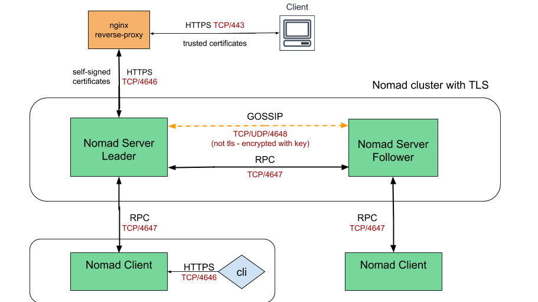

## Nomad cluster with NGINX as a reverse proxy, serving HTTPS encrypted traffic from client while getting the content via HTTP from Nomad backend

## High Level Overview



### When using NGINX as a reverse proxy, it serving HTTPS encrypted traffic from client while getting the content via HTTP from Nomad backend, thus offload the SSL decryption processing from backend servers. 

#### There are a number of advantages of doing decryption at the proxy:

- Improved performance – To improve performance, the server doing the decryption caches SSL session IDs and manages TLS session tickets. If this is done at the proxy, all requests from the same client can use the cached values.

- Better utilization of the backend servers – SSL/TLS processing is very CPU intensive. Removing this work from the backend servers allows them to focus on delivering service.

- Intelligent routing – By decrypting the traffic, the proxy has access to the request content, such as headers, URI and can use this data to route requests.

- Certificate management – Certificates only need to be purchased and installed on the proxy servers and not all backend servers.

- Security patches – If vulnerabilities arise in the SSL/TLS stack, the appropriate patches need to be applied only to the proxy servers.

### Prerequisites

- git
- terraform
- own or control the registered domain name for the certificate
- have a DNS record that associates your domain name and your server’s public IP address
- AWS subscription
- ssh key

## How to run

- Get the repo

```
https://github.com/achuchulev/secure-nomad-https.git
cd secure-nomad-https
```

- Create `terraform.tfvars` file

```
access_key = "your_aws_access_key"
secret_key = "your_aws_secret_key"
ami = "your_ami_id"
instance_type = "t2.micro"
subnet_id = "subnet_id"
vpc_security_group_ids = ["security_group/s_id/s"]
public_key = "your_public_ssh_key"
```

```
Note: Security group in AWS should allow ssh on port 22 and https on port 443.
```

- Edit script `scripts/provision` and set below variables under section *Generate certificate*

```
EMAIL=you@example.com
DOMAIN_NAME=your.dns.name
```

- Initialize terraform
```
terraform init
```

- Deploy nginx and nomad instances

```
terraform plan
terraform apply
```

- `Terraform apply` will:
  - create new instance on AWS
  - copy all configuration files from `config/` to user's home directory `~/`
  - install nginx
  - configure nginx
  - install nomad
  - install certbot
  - automatically enable HTTPS on website with EFF's Certbot, deploying Let's Encrypt certificate
  - check for certificate expiration and automatically renew Let’s Encrypt certificate
  - start nomad server and client in background

### Access nomad web console

Open web browser, access nomad web console using your instance dns name for URL and verify that connection is secured and SSL certificate is valid
