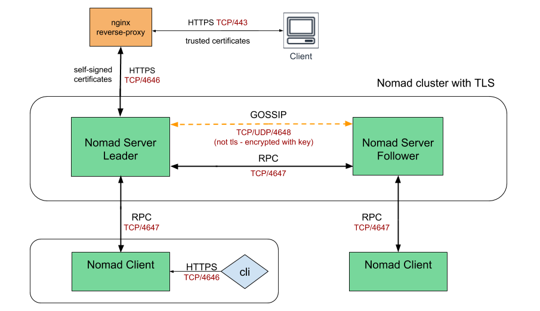

# Example of Nomad cluster with NGINX as a reverse proxy, serving HTTPS encrypted traffic from client while getting the content via HTTP from Nomad backend

## High Level Design

### When using NGINX as a reverse proxy, it serving HTTPS encrypted traffic from client while getting the content via HTTP from Nomad backend, thus offload the SSL decryption processing from backend servers. 

#### There are a number of advantages of doing decryption at the proxy:

- Improved performance – To improve performance, the server doing the decryption caches SSL session IDs and manages TLS session tickets. If this is done at the proxy, all requests from the same client can use the cached values.

- Better utilization of the backend servers – SSL/TLS processing is very CPU intensive. Removing this work from the backend servers allows them to focus on delivering service.

- Intelligent routing – By decrypting the traffic, the proxy has access to the request content, such as headers, URI and can use this data to route requests.

- Certificate management – Certificates only need to be purchased and installed on the proxy servers and not all backend servers.

- Security patches – If vulnerabilities arise in the SSL/TLS stack, the appropriate patches need to be applied only to the proxy servers.
